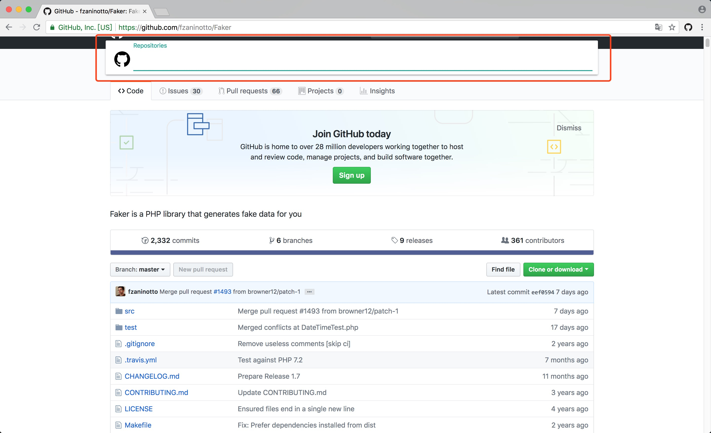
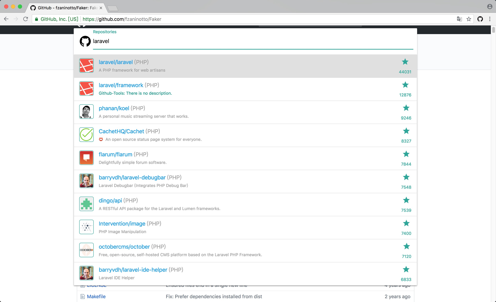

# Github Tools

A Chrome browser extension that allows you to quickly search for repositories and view incoming notifications without opening Github.

## Installation

[Chrome Extension Store](https://chrome.google.com/webstore/detail/github-tools/knlogcefmjnaihepamjbckcjcabpbkeg)

## Usage

Just press `Ctrl + G`, and input the repository's name. It shows like this:

And then, you can press `ctrl + j/k` or `↑/↓` to move focus, press `Enter` to open it in a new tab.

To close it just press `ctrl + [` or `Esc`.

If you use **Windows** or **Linux**, maybe you should change the shortcuts [here](chrome://extensions/shortcuts).

**Happy Searhing !**
